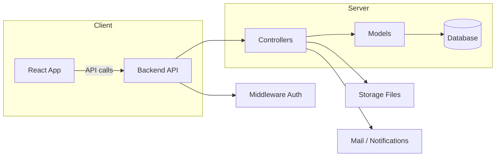
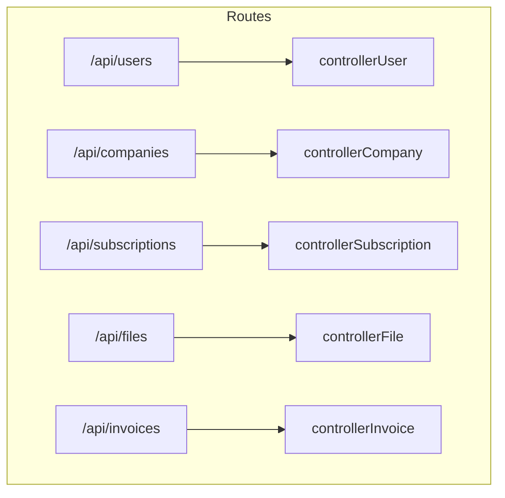

#### README TEMPORAIRE

<div align="center">


<h1>VitruveCloud</h1>

Tisma : [](https://wakatime.com/badge/user/a16f794f-b91d-4818-8dfc-d768ce605ece/project/ea31d8db-33d3-4d8c-a21b-354e4fd0833f)

</div>

---

Solution cloud pour la gestion de fichiers, abonnements et facturation.

---

## Sommaire

- [Présentation](#présentation)
- [Contexte académique / objectif](#contexte-academique--objectif)
- [Architecture générale](#architecture-générale)
	- [Diagramme d'architecture (Mermaid)](#diagramme-darchitecture-mermaid)
	- [Diagramme des routes principales](#diagramme-des-routes-principales)
- [Structure du projet](#structure-du-projet)
- [Emplacements pour images](#emplacements-pour-images)
- [Installation](#installation)
	- [Prérequis](#prérequis)
	- [Backend](#backend)
	- [Frontend](#frontend)
- [Exécution](#exécution)
	- [Variables d'environnement et sécurité](#variables-denvironnement-et-sécurité)
- [Tests](#tests)
- [Déploiement](#déploiement)
- [Contribution](#contribution)
- [Licence](#licence)

---

## Présentation

Tisma est une solution cloud de type "Google Drive" destinée à stocker et partager des fichiers utilisateurs, gérer des abonnements, générer des factures et conserver des logs d'activité. Le frontend est développé en React et le backend en Node.js avec Express. La base de données et les modèles sont organisés dans `backend/database/models`.


### Contexte académique / objectif

Ce projet a été réalisé comme projet de fin d'année 2024 pour le Bachelor Développeur FullStack & DevOps. L'objectif est de démontrer la maîtrise des compétences suivantes : conception d'API REST sécurisées, gestion de fichiers et stockage cloud, intégration frontend React, gestion d'abonnements et pipelines de déploiement (CI/CD / Docker / orchestration possible).

---

## Architecture générale

Le projet est composé de deux parties principales :

- `backend/` : serveur Express, routes, contrôleurs, modèles et middleware.
- `front/` : application React (Vite ou Create React App selon configuration), composants et pages.

<a name="diagramme-darchitecture-mermaid"></a>
### Diagramme d'architecture (Mermaid)



<a name="diagramme-des-routes-principales"></a>
### Diagramme des routes principales



<a name="structure-du-projet"></a>
## Structure du projet

Arborescence principale (extraits) :

- backend/
	- server.js            # point d'entrée Express
	- package.json
	- controllers/         # logique métier par entité
	- routes/              # définition des routes API
	- database/            # connexion et modèles
	- middleware/          # authentification et validation

- front/
	- package.json
	- src/
		- Components/        # composants réutilisables
		- Pages/             # pages de l'application

## Emplacements pour images

- Présentation du projet (bannière) : ajouter `docs/images/banner.png` ou `docs/images/banner.svg`.
- Diagrammes et captures d'écran : `docs/images/screenshots/`.

Exemple d'insertion dans ce README :


> Si l'image n'existe pas, gardez le chemin comme espace réservé.

## Installation

Remarque : ces instructions supposent que vous êtes sur Windows avec PowerShell (versions récentes de Node.js recommandées).

### Prérequis

- Node.js (>= 14) et npm ou yarn
- Git

### Backend

1. Ouvrez un terminal à la racine du projet et installez les dépendances du backend :

```shell
cd backend
npm install
```

2. Configuration :
- Vérifiez `backend/config/config.json` pour les variables d'environnement locales (port, DB, etc.).

3. Démarrer le serveur :

```shell
cd backend
npm start
```

<a name="frontend"></a>
### Frontend

1. Ouvrez un second terminal et installez les dépendances du frontend :

```shell
cd front
npm i
```

2. Démarrer l'application React :

```shell
cd front
npm start
```

3. L'application sera typiquement disponible sur `http://localhost:3000` (ou le port configuré).

<a name="exécution"></a>
## Exécution

- Backend : `http://localhost:PORT/api/...` (voir `backend/server.js` pour le port par défaut).
- Frontend : `http://localhost:3000`.

<a name="variables-denvironnement-et-sécurité"></a>
### Variables d'environnement et sécurité

- Utilisez des variables d'environnement pour les secrets (JWT_SECRET, DB_URL, SMTP credentials). Ne commitez jamais de secrets.
- Vous pouvez utiliser un fichier `.env` à la racine de `backend/` et `front/` le charger via `dotenv`.

#### Variables d'environnement — Backend

Voici les variables couramment utilisées côté backend et leur rôle :

- `XXX` : XXXX (ex: XXXX)

```
XXX
```

#### Variables d'environnement — Frontend

Le frontend React peut utiliser des variables d'environnement préfixées (ex: `REACT_APP_` pour Create React App) :

- `XXX` : XXXX (ex: XXXX)

```
XXX
```